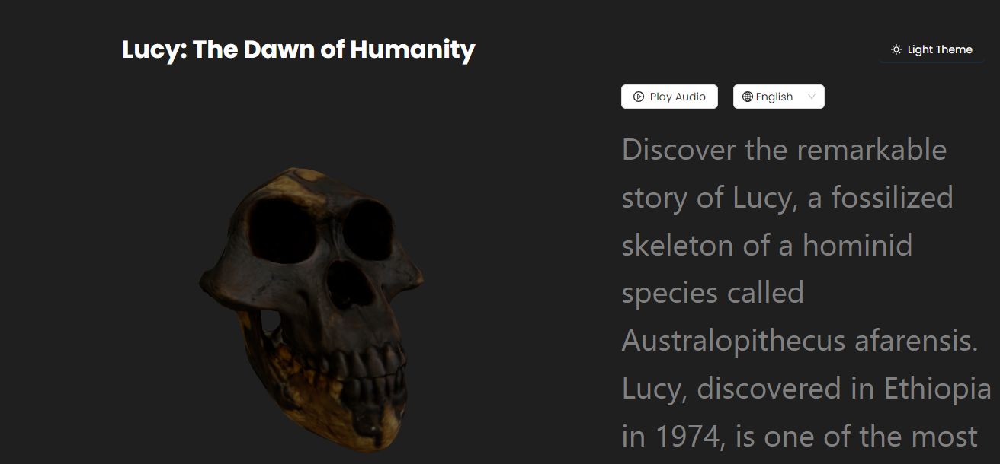
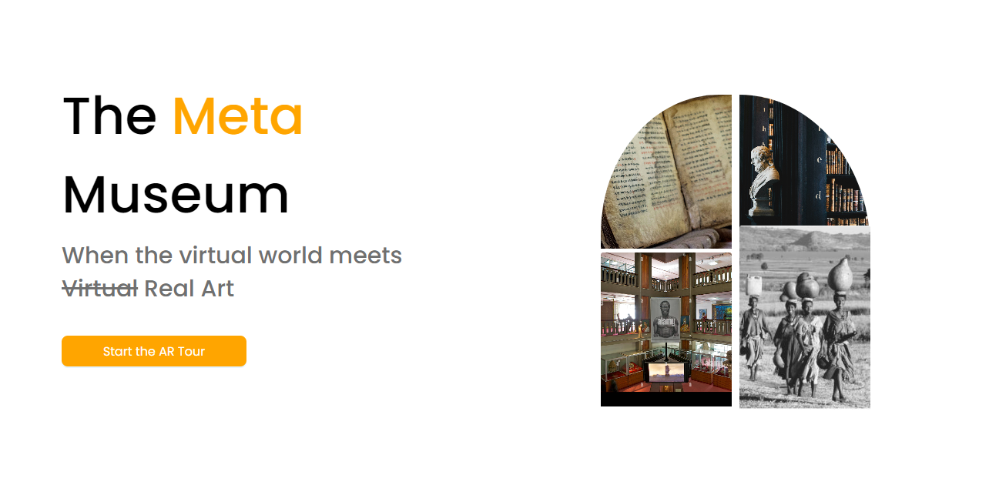
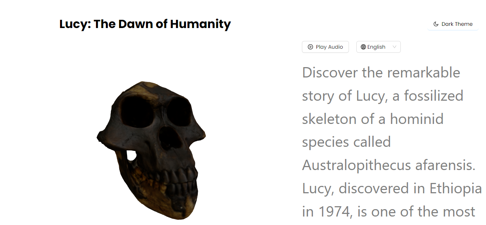
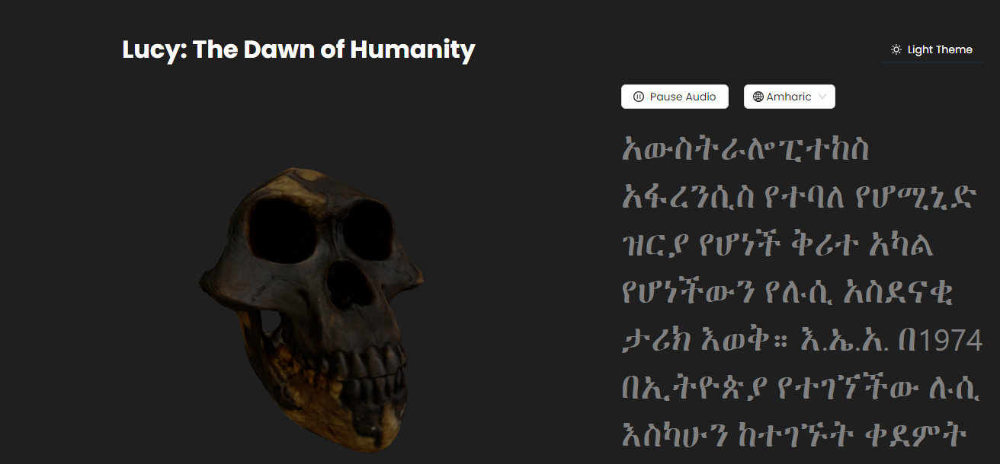

# Virtual Museum
  

Welcome to the Virtual Museum! Explore historical artifacts and exhibits from the comfort of your home.

## Table of Contents

- [About the Project](#about-the-project)
- [Features](#features)
- [Technologies Used](#technologies-used)
- [Getting Started](#getting-started)
- [Usage](#usage)
- [Contact](#contact)
- [License](#license)

## About the Project

The Virtual Museum is an interactive platform that allows users to explore historical artifacts and exhibits through a digital interface. With support for multiple languages and a dark/light theme toggle, the museum provides an inclusive and customizable experience for visitors.

## Features

- **Interactive 3D Exhibits**: Explore historical items in 3D with interactive navigation.
- **Multi-Language Support**: Choose from six languages: Amharic, English, Somali, Oromo, Tigrigna, and [add the sixth language].
- **Dark/Light Theme Toggle**: Customize the museum's appearance with a dark or light theme.
- **Audio Narration**: Enjoy immersive audio narration for each exhibit, providing additional context and information.

## Technologies Used

- **Frontend**: React.js
- **3D Visualization**: [Add 3D visualization library used]
- **Styling**: CSS (or any CSS framework you used)
- **Audio Integration**: [Add audio library used]
### Home Page

### Showroom light theme

### One of the language feature Amharic

## Getting Started

To get a local copy up and running, follow these steps:

### Prerequisites

- Ensure you have Node.js and npm installed.

### Installation

1. Clone the repository:

    ```sh
    git clone https://github.com/st-miki/VR-Museum.git
    ```

2. Navigate to the project directory:

    ```sh
    cd VR-Museum
    ```

3. Install the dependencies:

    ```sh
    npm install
    ```

### Running the App

Start the development server:

```sh
npm start
```
Open your browser and navigate to http://localhost:3000 to explore the Virtual Museum.

### Usage
Explore the Virtual Museum and navigate through the exhibits using the provided controls. Use the language selector and theme toggle to customize your experience.

### Contact
Feel free to reach out if you have any questions or suggestions!

Email: mikiengida52@gmail.com<br>
Twitter: @st_mickey_<br>
### License
Distributed under the MIT License. See LICENSE for more information.
